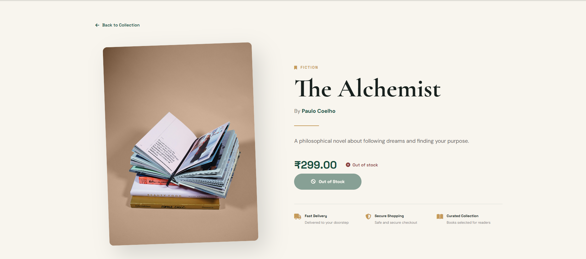
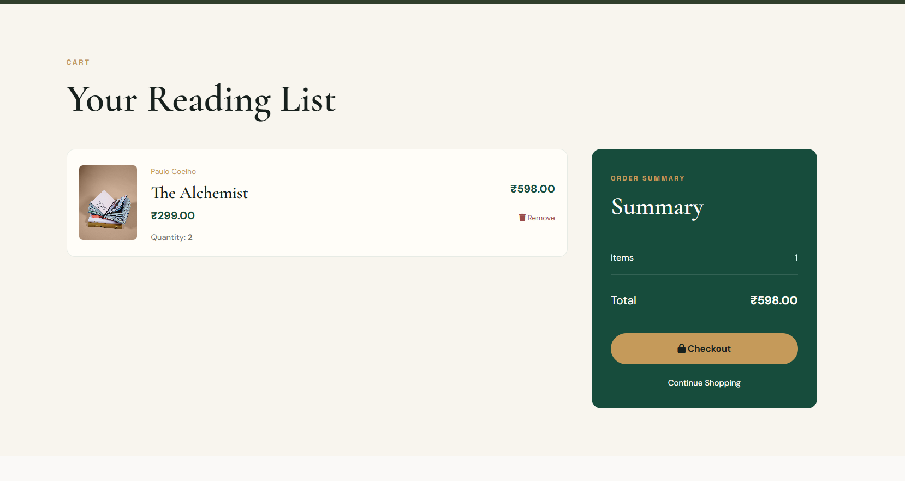

# Readify - Online Book Store

Readify is a responsive online book store developed as a Web Technologies project.  
It provides a simple and modern platform where users can browse books, view detailed information, authenticate themselves, add books to a cart, and manage their cart.

The application uses Node.js and Express for the backend, EJS for server-side rendering, and MySQL for persistent data storage.

---

## Features

- Responsive and modern user interface
- Home page with featured book collection
- Book catalogue
- Individual book details page
- User registration
- User login and session-based authentication
- Add books to cart
- Cart data stored in MySQL database
- Automatic quantity update for repeated cart additions
- Remove books from cart
- Dynamic cart total calculation
- Responsive design for desktop and mobile devices
- Interactive UI elements and animations
- Secure password hashing using bcrypt

---

## Screenshots

### Home Page


### Book Catalogue


### Book Details



### Shopping Cart



---

## Technology Stack

### Frontend

- HTML5
- CSS3
- JavaScript
- EJS
- Font Awesome
- Google Fonts

### Backend

- Node.js
- Express.js
- Express Session

### Database

- MySQL

### Additional Technologies

- bcryptjs
- dotenv
- express-validator
- mysql2
- Nodemon

---

## Project Structure

```text
Readify/
│
├── backend/
│   ├── config/
│   │   └── db.js
│   │
│   ├── controllers/
│   │   ├── authController.js
│   │   ├── bookController.js
│   │   └── cartController.js
│   │
│   ├── middleware/
│   │   ├── auth.js
│   │   └── errorHandler.js
│   │
│   ├── models/
│   │   ├── Book.js
│   │   ├── Cart.js
│   │   └── User.js
│   │
│   └── routes/
│       ├── authRoutes.js
│       ├── bookRoutes.js
│       └── cartRoutes.js
│
├── database/
│   └── sql/
│       ├── schema.sql
│       └── seed.sql
│
├── frontend/
│   ├── public/
│   │   ├── css/
│   │   │   └── style.css
│   │   ├── js/
│   │   │   ├── main.js
│   │   │   └── cart.js
│   │   └── images/
│   │
│   └── views/
│       ├── auth/
│       │   ├── login.ejs
│       │   └── register.ejs
│       │
│       ├── books/
│       │   ├── details.ejs
│       │   └── books.ejs
│       │
│       ├── cart/
│       │   └── cart.ejs
│       │
│       ├── errors/
│       │   ├── 404.ejs
│       │   └── 500.ejs
│       │
│       ├── partials/
│       │   ├── footer.ejs
│       │   ├── header.ejs
│       │   └── navbar.ejs
│       │
│       └── home.ejs
│
├── .env
├── .gitignore
├── package.json
├── package-lock.json
├── README.md
└── server.js